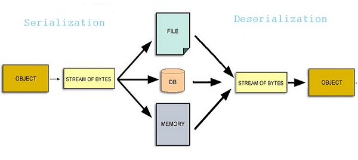

# Introduction to YAML

## What is YAML?
YAML *(YAML Ain't Markup Language)* is a human-readable [data serialization](https://devopedia.org/data-serialization) format used for configuration files, data exchange, and infrastructure as code (IaC).

It is Commonly used in DevOps tools like Docker, Kubernetes, GitHub Actions, Ansible, and CI/CD pipelines. YAML files either have the extension `.yaml` or `.yml`.



Data Serialization is the process of converting a data structure or object into a format that can be easily stored, transmitted, or persisted. The resulting serialized data is often in a standardized, platform-independent format, such as JSON, XML, or binary data.

Data Deserialization is the process of reconstructing a data structure or object from its serialized form. It involves interpreting the serialized data and creating an equivalent object or data structure.

## Why YAML in DevOps?
- Human-readable (easier than JSON/XML for configs).

- Widely adopted in DevOps tools (Kubernetes, Ansible, Docker, CI/CD pipelines).

- Supports complex structures (lists, dictionaries, nested objects).

## What is a YAML used for?

- **Configuration management (CM)** – Ansible uses yaml files to describe all CM configurations (playbooks, roles, etc.).
- **Infrastructure as code (IaC)** – OpenTofu, for example, can read yaml files and use them as input for different resources, data sources, and even outputs.
- **CI/CD** – Many CI/CD products rely on yaml to describe their pipelines (GitHub Actions, GitLab CI/CD, Azure DevOps, CircleCI)
- **Container orchestration (CO)** – K8s and Docker Compose rely heavily on yaml files to describe the infrastructure resources.
- **Data serialization** – YAML can be used to describe complex data types such as lists, maps, and objects.
- **APIs** – YAML can be used in defining API contracts and specifications (e.g. OpenAPI).


## Example: Simple YAML File
```yaml
# A simple YAML configuration
name: DevOps Team
members: 5
tools: [Docker, Kubernetes, Ansible]
active: true
```

## Key Rules
- Use key: value pairs

- Use indentation with spaces (not tabs!)

- Strict syntax: Case-sensitive

- Allows comments with #, JSON do not

- create multiple-line document within a file with --

- End a document with ...

- More powerful when representing complex data

